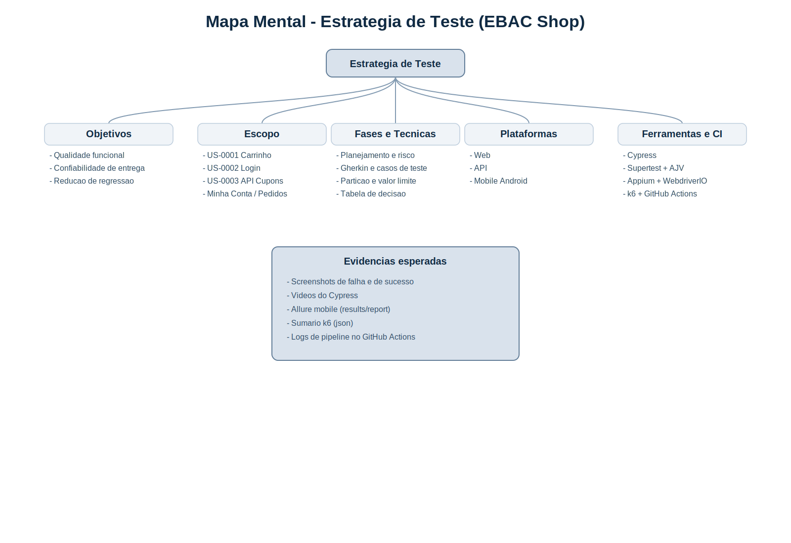

# Mapa mental - Estrategia de Teste

Imagem gerada para uso no trabalho final:



Versao textual:

```text
Estrategia de Teste
|-- Objetivos
|   |-- Qualidade funcional
|   |-- Confiabilidade de entrega
|   `-- Reducao de regressao
|-- Escopo
|   |-- US-0001 Carrinho
|   |-- US-0002 Login
|   |-- US-0003 API Cupons
|   |-- Catalogo Web
|   |-- Minha Conta
|   |-- Meus Pedidos
|   |-- Enderecos
|   `-- Detalhes da Conta
|-- Fases
|   |-- Planejamento
|   |-- Criterios Gherkin
|   |-- Casos de teste
|   |-- Automacao
|   |-- Execucao
|   `-- Evidencias
|-- Tipos de teste
|   |-- Funcional
|   |-- Regressao
|   |-- Exploratorio
|   |-- Contrato API
|   `-- Performance
|-- Tecnicas
|   |-- Particao de equivalencia
|   |-- Valor limite
|   |-- Tabela de decisao
|   `-- Risco
|-- Plataformas
|   |-- Web
|   |-- API
|   `-- Mobile Android
|-- Ferramentas
|   |-- Cypress
|   |-- Supertest + Jest + AJV
|   |-- Appium + WebdriverIO
|   |-- k6
|   `-- GitHub Actions
`-- Evidencias
    |-- Screenshots
    |-- Videos
    |-- Logs
    `-- Relatorios
```
